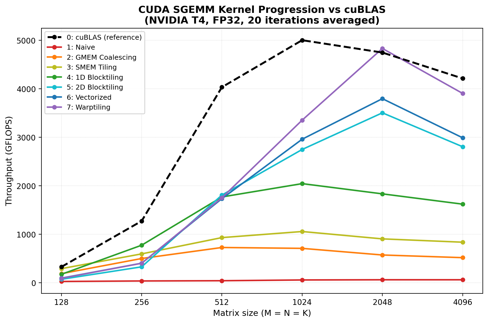

# CUDA SGEMM — optimizing matrix multiplication kernel by kernel

This is my implementation of single-precision matrix multiplication
(SGEMM: `C = alpha*A*B + beta*C`) in CUDA, built up as a series of kernels,
each one fixing whatever was slow about the last one. It starts from the
dumbest possible version and ends up close to cuBLAS.

I didn't write this to replace cuBLAS — nobody needs another GEMM library.
I wrote it because I wanted to actually understand *why* GPU matmul is fast
or slow, instead of just calling a function and trusting the number it
gives back.

## The kernels

| # | Kernel | What it does |
|---|--------|---------------|
| 1 | Naive | One thread per output element. No caching, no thought given to memory access patterns. |
| 2 | Global memory coalescing | Same work, but threads in a warp now read consecutive addresses instead of scattered ones. |
| 3 | Shared memory tiling | Cache tiles of A and B in shared memory so the same values aren't re-fetched from global memory over and over. |
| 4 | 1D block tiling | Each thread now computes several outputs instead of one, so SMEM loads get reused more. |
| 5 | 2D block tiling | Each thread computes a small square of outputs instead of a strip — more reuse per load. |
| 6 | Vectorized memory access | Switch to float4 loads and transpose A in shared memory so those loads are contiguous too. |
| 7 | Warp tiling | Organize the work warp-by-warp on top of everything above, mainly to deal with shared memory bank conflicts. |

Kernel 7 is the one that took the longest to actually get right — the index
math for splitting a warp's tile into sub-tiles is not intuitive on a first
pass, and I rewrote it a few times before the dimensions actually lined up.

## Results

Benchmarked against `cublasSgemm` on a Tesla T4 (Colab free tier), FP32,
20 iterations averaged per data point, square matrices.



At 4096×4096×4096:

| Kernel | GFLOPS | % of cuBLAS |
|---|---|---|
| 1: Naive | 61.8 | 1.5% |
| 2: GMEM Coalescing | 518.1 | 12.3% |
| 3: SMEM Tiling | 836.9 | 19.9% |
| 4: 1D Blocktiling | 1621.7 | 38.5% |
| 5: 2D Blocktiling | 2806.2 | 66.6% |
| 6: Vectorized | 2990.4 | 70.9% |
| 7: Warptiling | 3905.9 | 92.7% |
| 0: cuBLAS | 4214.9 | 100% |

Naive to warptiled is about a 63x speedup at this size.

One thing I noticed and don't have a fully satisfying answer for yet:
at size 2048, kernel 7 actually comes out slightly *ahead* of cuBLAS
(4833 vs 4749 GFLOPS). My best explanation is that cuBLAS picks a kernel
at runtime based on a heuristic tuned for broad coverage across shapes and
GPUs, not for any one specific size — so it's entirely possible my fixed
tile sizes just happen to fit that particular shape on this particular GPU
better than whatever cuBLAS's heuristic selected. It still wins comfortably
everywhere else, which fits that explanation.

Also worth being upfront about: this only uses regular CUDA cores. No
Tensor Cores, no FP16/TF32 paths, none of that — which is probably the
single biggest reason cuBLAS still pulls ahead at most sizes. That would
be the obvious next thing to add if I keep going with this.

## Project layout

```
gemm-lib/
├── include/
│   └── gemm.cuh
├── src/
│   ├── kernels/
│   │   ├── 01_naive.cu
│   │   ├── 02_coalescing.cu
│   │   ├── 03_smem_tiling.cu
│   │   ├── 04_1d_blocktiling.cu
│   │   ├── 05_2d_blocktiling.cu
│   │   ├── 06_vectorized.cu
│   │   └── 07_warptiling.cu
│   ├── runner.cu
│   └── main.cu
├── scripts/
│   ├── run_benchmark.sh
│   └── plot_benchmark.py
├── gemm_benchmark.png
├── CMakeLists.txt
└── README.md
```

## Building

You'll need an NVIDIA GPU and the CUDA toolkit. I tested this on Colab's
free T4 runtime.

```bash
cmake -B build -DCMAKE_BUILD_TYPE=Release
cmake --build build --parallel
```

This gives you one binary: `build/sgemm`.

## Running it

```bash
# kernel 7 (warptiling), size 4096, with correctness check + benchmark
./build/sgemm 7 4096

# kernel 0 = cuBLAS reference, for comparison
./build/sgemm 0 4096

# full sweep across all kernels and sizes
./scripts/run_benchmark.sh
```

Every custom kernel gets checked against `cublasSgemm` before it's
benchmarked — same random inputs, compared element-by-element with a
combined absolute+relative tolerance (this matters more than it sounds:
pure relative error blows up on values close to zero, which had me
chasing a fake bug for a while before I caught it).

To regenerate the chart above from your own numbers:

```bash
pip install matplotlib
python scripts/plot_benchmark.py
```

Just edit the `data` dict at the top of that script with whatever you get
from your own GPU.

## Why some kernels are slower than they "should" be

If you run this yourself you'll notice kernel 6 (vectorized) is sometimes
*slower* than kernel 5 (2D blocktiling) at smaller sizes. In the reference
material this is based on, vectorization is supposed to be a strict
improvement. I haven't fully tracked down why that's not the case here —
my guess is it's GPU- and size-dependent (T4 vs whatever the original
benchmarks were run on), but I'm not certain. Flagging it here instead of
pretending the numbers are cleaner than they are.

## What this is based on

The optimization sequence and benchmarking approach follow Simon Boehm's
CUDA SGEMM writeup (siboehm/SGEMM_CUDA) — I'd recommend reading the
original article alongside this code, it explains the reasoning behind
each step in more depth than the comments here do. I wrote and debugged
every kernel myself rather than copying the reference implementation
directly, which is also why some of the rough edges above exist instead of
this being a clean port.
